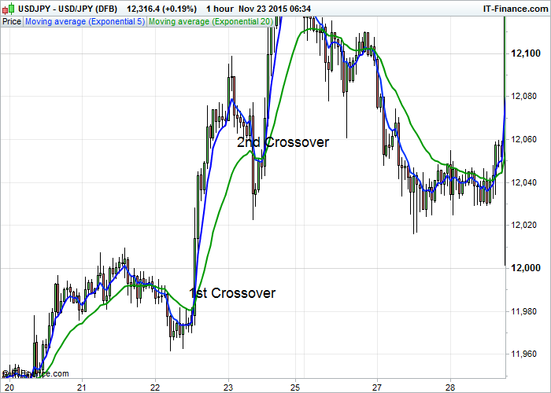

# Cryptocurrency Trading Bot 
I'm using this bot for a long time now and wanted to share it. 


Feel free to make it your own. PRs are welcome!

## USE AT YOUR OWN RISK
A trading bot that does what you order him to do (use at your own risk)

I'm not responsible for anything

## EMA crossover strategy
It's using the ema crossover strategy. But instead of EMA 5 and EMA 20 I'm using EMA 9 and EMA 26

https://www.theforexchronicles.com/the-ema-5-and-ema-20-crossover-trading-strategy/



## Donations

To support this project, you can make a donation to its current maintainer:

[](https://paypal.me/Saschb2b)

Bitcoin: 19yG1s5s1s4JnfdsNLfVy3GS6GYPxgG3BY

Ethereum: 0x2146e4337b4d7b17899b71694456b13f434fb3e4

Doge: DJ6JwaBJ6QwyaDLfYsNdre52sf1C7Abm5B

Litecoin: LSVno86JENvnEmdCrY6sVNGGe7KM2HyLKm

## Program Sequence

## Main loop
```
  start = async () => {
    const start = now();
    log.info(`########## Started ichimoku ##########`);

    await this.collectRevenue();

    const markets: Market[] = await this.getMarkets();
    const marketSummaries: MarketSummary[] = await this.getMarketSummaries(
      markets
    );
    await this.evaluateMarkets(marketSummaries.map(({ symbol }) => symbol));

    // await this.report();

    log.info(`########## Finished ${(now() - start).toFixed(5)} ms ##########`);
  };
```

## Collecting Revenue
```
    await this.collectRevenue();
```
* Fetch you current balances
  * Only checks assets where available coins are greater than 0
  * Ignore assets that you want to HODL see config
* Iterate over every balance
  * Fetch current market ticker for this balance (e.g. `ETH-USDT`)
  * Calculates how much revenue is already earned (current value minus invest)
  * When greate than invest try to sell that bit
    * e.g. Current value 57 USDT with an invest of 50 USDT -> sell 7 USDT worth
    * It can only sell when the quantity will be greater than the minimum trade size allowed by bittrex
    
## Evaluate Markets
```
    const markets: Market[] = await this.getMarkets();
    const marketSummaries: MarketSummary[] = await this.getMarketSummaries(
      markets
    );
    await this.evaluateMarkets(marketSummaries.map(({ symbol }) => symbol));
```
* Filter the markets `getMarkets` and `getMarketSummaries`
  * Only use markets using the `config.mainMarket` here `USDT`
  * Only use market which are `ONLINE`
  * Check against market summary to see if the quote volume is greater than 0 (market is being traded on)
* Use those filtered marked for the next step -> `evaluateMarkets`
* Iterate over every market
  * Ignore HODL markets (just buy some manually and HODL on)
  * Get candles
  * Count EMA ticks. Positive and negative
  * If you got some of that asset in your balance
    * If it's on the blacklist it will sell it. E.g. Bittrex delisting coins
    * If it got too many negative ticks it will sell it
  * If you don't have any of that asset in you balance
    * If it's not blacklisted and got the amount of positiv ticks it will buy

**Selling**: It will be a limit sell with `timeInForce: TimeInForce.FILL_OR_KILL` Meaning, either it gets sold directly or the order gets canceled and will be tried next round.

**Buying**: The positiv ticks need to be exact the value defined in the config. This will prevent buying into a market "too late"

## (optional) Report
```
    // await this.report();
```
Enable this line to report your current state. You will also need to enter your url in `api/BittrexApi.ts report()`

This could be used to track your bot and how much your balances are worth over time. 

## Requirements
Node.js

As package manager install yarn https://classic.yarnpkg.com/en/docs/install

## Usage

### Bittrex API key and API secret
How to get: https://support.coinigy.com/hc/en-us/articles/360001123973-How-do-I-find-my-API-key-on-Bittrex-com-

Set `BITTREX_API_KEY` and `BITTREX_API_SECRET` as environment variables.

Easiest way is to add an `.env` file into the root project folder `./.env` wit the content
```
BITTREX_API_KEY=YOUR_BITTREX_API_KEY
BITTREX_API_SECRET=YOUR_BITTREX_API_SECRET
```
otherwise see the provided `.env.template` file.

If no keys were found you'll get an error message `No BITTREX_API_KEY and or BITTREX_API_SECRET found. Check your environment variables`

### Adapt the config
Change the configuration parameters to your liking `config.json`

For more details see the documentation in `./modules/configuration/Configuration.ts`

## Build and start
```
yarn
yarn start
```

This will create a `/dist` folder and start the containing `/dist/index.js` file

## Build bundle
```
yarn
yarn build
```

This will create a `/dist` folder containing the created `.js` files. You could now deploy it on any server you like

## Development
```
yarn
yarn start:dev
```

This will start the bot in a watch mode. On every code change it will recompile and restart
