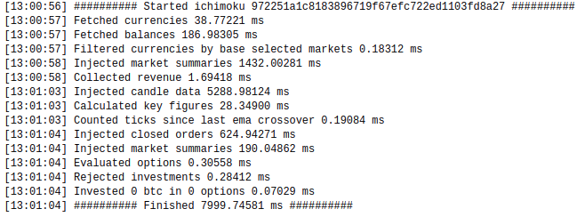

# USE AT OWN RISK
A trading bot that does what you order him to do (use at your own risk)

I'm using this bot now for a long time and wanted to share it. It's using the ema crossing strategy kinda.
Feel free to make it your own. PRs are also welcome!

https://www.theforexchronicles.com/the-ema-5-and-ema-20-crossover-trading-strategy/


## Usage

Add `apiKey` and `apiSecret` from bittrex to your `./config/index.js`
See https://support.coinigy.com/hc/en-us/articles/360001123973-How-do-I-find-my-API-key-on-Bittrex-com-

Tweak the other configuration options to your liking.

```
npm i
npm run start:dev
```

You can also use the included `Dockerfile` to build an image and deploy it wherever you want.

